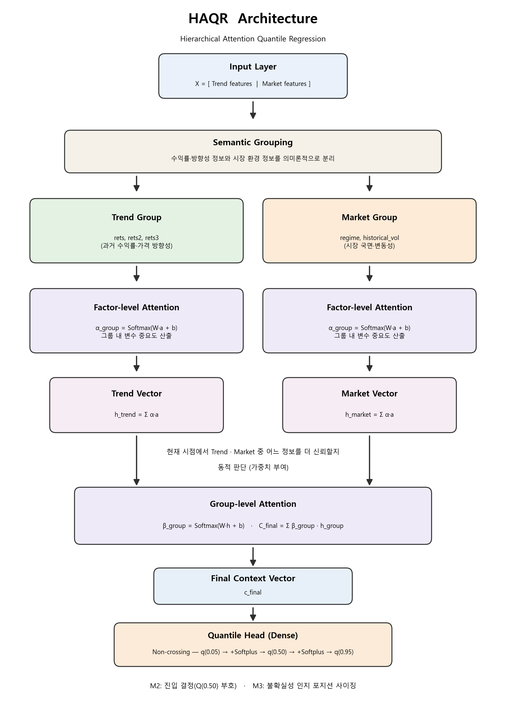

# HAQR: Hierarchical Attention Quantile Regression

## 📄 연구 보고서

- [**리스크 정량화와 포지션 사이징을 위한 계층적 어텐션 퀀타일 회귀 (연구 보고서 PDF)**](./리스크%20정량화와%20포지션%20사이징을%20위한%20계층적%20어텐션%20퀀타일%20회귀.pdf)

---

> 금융 시계열의 꼬리위험을 정량화하는 모델이다. 2단계 계층 어텐션으로 피처 중요도를 학습하고, Non-Crossing Quantile Head로 분위수가 서로 교차하지 않는 예측 구간을 만든다. 불확실성 구간은 모델이 스스로 출력한다.

## ⭐ 성과

- **Sharpe 1.05**, 튜닝한 LGBM(0.82)보다 개선
- **Pinball Loss 0.00584**, LGBM(0.00612)보다 하락
- **손실구간 91% 적중**
- **PSR 0.78 · DSR 0.45**, 여러 번 시도할 때 생기는 편향을 보정한 확률적 샤프 지표
- **Non-Crossing 보장**: Q5 < Q50 < Q95를 Softplus 델타로 원천 보장
- **F-Fidelity XAI 검증 통과**, 어텐션 가중치의 충실성 입증

## 핵심 기여

| 기여 | 내용 |
|---|---|
| **Hierarchical Attention Network** | Factor-Level→Group-Level 2단계 어텐션으로 피처 중요도를 계층적으로 학습 |
| **Non-Crossing Quantile Head** | Softplus 델타 구조를 써서 분위수 교차 문제를 원천 차단한다(Q5<Q50<Q95 보장) |
| **Intrinsic Uncertainty** | 별도 보정(calibration) 없이 모델 자체가 불확실성 구간을 낸다 |
| **Explainable AI** | F-Fidelity 검증으로 어텐션 가중치가 실제 예측에 충실함을 입증 |

## 아키텍처

<p align="center">
  
</p>


## 실험 결과

### SOTA 비교 (N=100 시뮬레이션)

| Model | Pinball Loss ↓ | Sharpe ↑ | PSR ↑ | DSR ↑ |
|-------|---------------|----------|-------|-------|
| LGBM (Tuned) | 0.00612 | 0.82 | 0.71 | 0.32 |
| **HAQR (Proposed)** | **0.00584** | **1.05** | **0.78** | **0.45** |

### 불확실성 정량화 (90% 예측 구간)

| Model | PICP (target 0.90) ↑ | MPIW ↓ |
|-------|---------------------|--------|
| LGBM (Raw) | 0.78 | 0.041 |
| LGBM + CQR | 0.91 | 0.062 |
| **HAQR (Intrinsic)** | **0.89** | **0.048** |

### XAI 검증 (F-Fidelity)

- MoRF: 중요 피처를 먼저 제거하면 Loss 급상승
- LeRF: 비중요 피처를 먼저 제거해도 Loss 유지
- F-Fidelity Score: MoRF - LeRF > 0 (유의미한 차이)

## 불확실성 인지 포지션 사이징 (M3 전략)

분위수 출력을 그대로 운용에 쓴다. Q50으로 방향을 정하고, Q95-Q05 폭이 넓으면 불확실성이 크다고 보고 포지션 크기를 줄인다.

```python
def calculate_m3_strategy(pred_quantiles, actual_returns, threshold):
    """
    M3 Strategy: Uncertainty-Aware Position Sizing
    - Signal: Q50 (중앙값) 기반 방향 결정
    - Size: Q95 - Q05 (Spread)가 넓으면 불확실 → 사이즈 축소
    """
    q05, q50, q95 = pred_quantiles[:, 0], pred_quantiles[:, 1], pred_quantiles[:, 2]
    signal = np.sign(q50)
    uncertainty = q95 - q05
    size = np.where(uncertainty > threshold, 0.5, 1.0)
    return signal * size * actual_returns
```

## 실험 구성

| 검증 | 내용 |
|---|---|
| SOTA | HAQR vs LGBM (N=100) |
| Lag-Llama | 시계열 파운데이션 모델 비교 |
| 불확실성 | PICP·MPIW로 불확실성 구간 검증 |
| XAI | F-Fidelity로 설명가능성 검증 |
| 경제성 | PSR·DSR로 경제적 성과 분석 |
| Ablation | 몬테카를로 구성 제거 연구 |

학습 데이터는 **이중 국면 AR(3) 프로세스(Dual-Regime AR(3))**로 생성했다.

| 파라미터 | 값 |
|---|---|
| 국면 1(정상) | φ=(0.25, -0.20, 0.35) |
| 국면 2(위기) | φ=(-0.25, 0.20, -0.35) |
| 국면 전환 확률 | 0.20 |
| 전체 스텝 | 5,000 |

## 저장소 구조

```
src/
  models.py    # HAQR 모델 정의 (HAN + Non-Crossing Quantile Head)
  data_gen.py  # Dual-Regime AR(3) 데이터 생성
  utils.py     # PSR·DSR·MDD 계산
experiment/    # SOTA·불확실성·XAI·경제성·Ablation 검증
```

## 기술 스택

Python 3.8+ · TensorFlow 2.x · LightGBM · SciPy · Monte Carlo 시뮬레이션 (FastAPI 서빙: alpha-serve)
