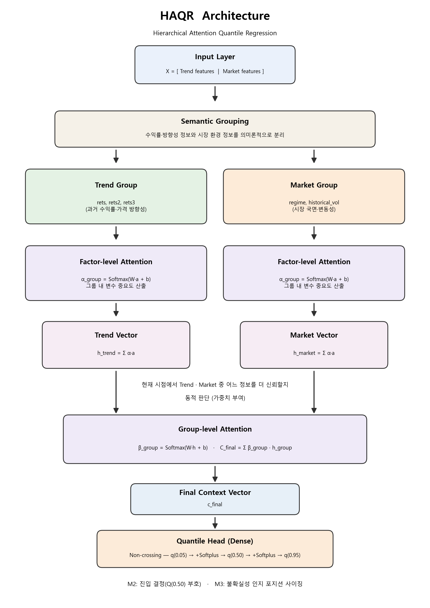

# HAQR: Hierarchical Attention Quantile Regression

## 📄 연구 보고서

- [**리스크 정량화와 포지션 사이징을 위한 계층적 어텐션 퀀타일 회귀 (연구 보고서 PDF)**](./리스크%20정량화와%20포지션%20사이징을%20위한%20계층적%20어텐션%20퀀타일%20회귀.pdf)

---

> 금융 시계열의 꼬리위험을 정량화하는 모델이다. 2단계 계층 어텐션으로 피처 중요도를 학습하고, Non-Crossing Quantile Head로 분위수가 서로 교차하지 않는 예측 구간을 만든다. 불확실성 구간은 모델이 스스로 출력한다.

## ⭐ 보고서 주요 결과

아래 수치는 연구 보고서의 **이중 국면 AR(3) 합성 데이터 실험**을 요약한 것이다. 이번 문서 정리에서 실험을 재실행하지 않았으며, 실시장 운용 실적을 뜻하지 않는다. 쪽수는 PDF의 물리 쪽수 기준이다.

- **Pinball Loss 0.003242**, Tuned LightGBM의 0.003501 대비 **약 7.4% 감소** (100회 반복 실험, §5.1, p.9)
- **Sharpe 5.2852**, Tuned LightGBM 1.3434와 비교한 **거래비용 제외 시뮬레이션 결과** (§5.1, p.9; 비용 제외 설명 §5.5, p.13)
- **90% 예측구간 커버리지(PICP) 91.48%**, 평균 구간 너비(MPIW) 0.0541 (§5.3 표 1, p.10). PICP는 실제 수익률이 예측구간 안에 포함된 비율이며, 거래 승률이나 방향 예측 적중률이 아니다.
- **Non-Crossing 보장**: Q5 < Q50 < Q95를 Softplus 델타로 원천 보장
- **F-Fidelity XAI 검증 수행**, 보고서에서 중요·비중요 피처 제거에 따른 손실 차이를 확인 (§5.4, pp.11-12)

기존 README의 다른 성과 수치에는 재현 가능한 실행 기록과 실험 조건이 연결되어 있지 않아 대표 결과에서 제외했다. PSR·DSR은 보고서에서 분석하지만, 본문에 명시되지 않은 수치 요약은 싣지 않는다.

## 핵심 기여

| 기여 | 내용 |
|---|---|
| **Hierarchical Attention Network** | Factor-Level→Group-Level 2단계 어텐션으로 피처 중요도를 계층적으로 학습 |
| **Non-Crossing Quantile Head** | Softplus 델타 구조를 써서 분위수 교차 문제를 원천 차단한다(Q5<Q50<Q95 보장) |
| **Intrinsic Uncertainty** | 별도 보정(calibration) 없이 모델 자체가 불확실성 구간을 낸다 |
| **Explainable AI** | F-Fidelity 검증으로 어텐션 중요도와 피처 제거 시 예측 손실의 관계를 평가 |

## 아키텍처

<p align="center">
  
</p>


## 실험 결과 (보고서 기준)

### Tuned LightGBM 비교 (N=100 시뮬레이션)

출처: 보고서 §5.1 (p.9). HAQR은 원문에 기재된 **Scale-Up** 모델이며, Sharpe는 거래비용을 제외한 전략 시뮬레이션 값이다 (§5.5, p.13).

| Model | Pinball Loss ↓ | Sharpe (거래비용 제외) |
|-------|---------------|----------|
| Tuned LightGBM | 0.003501 | 1.3434 |
| **HAQR (Scale-Up)** | **0.003242** | **5.2852** |

핀볼 손실 감소율은 `(0.003501 - 0.003242) / 0.003501 × 100 = 7.3979%`로, 소수 첫째 자리에서 약 7.4%다.

### 불확실성 정량화 (90% 예측 구간)

출처: 보고서 §5.3 표 1 (p.10). PICP는 목표 커버리지 0.90에 얼마나 가까운지 MPIW와 함께 평가한다. 커버리지만 높다고 항상 더 좋은 예측구간은 아니다.

| Model | PICP (target 0.90) | MPIW |
|-------|---------------------|--------|
| LGBM (Raw) | 0.7508 | 0.0390 |
| LGBM + CQR | 0.9084 | 0.0548 |
| **HAQR (Intrinsic)** | **0.9148** | **0.0541** |

### XAI 검증 (F-Fidelity)

- MoRF: 중요 피처를 먼저 제거하면 Loss 급상승
- LeRF: 비중요 피처를 먼저 제거해도 Loss 유지
- F-Fidelity Score: MoRF - LeRF > 0 (유의미한 차이)

## 불확실성 인지 포지션 사이징 (M3 전략)

분위수 출력을 그대로 운용에 쓴다. Q50으로 방향을 정하고, Q95-Q05 폭이 넓으면 불확실성이 크다고 보고 포지션 크기를 줄인다.

```python
def calculate_m3_strategy(pred_quantiles, actual_returns, threshold):
    """
    M3 Strategy: Uncertainty-Aware Position Sizing
    - Signal: Q50 (중앙값) 기반 방향 결정
    - Size: Q95 - Q05 (Spread)가 넓으면 불확실 → 사이즈 축소
    """
    q05, q50, q95 = pred_quantiles[:, 0], pred_quantiles[:, 1], pred_quantiles[:, 2]
    signal = np.sign(q50)
    uncertainty = q95 - q05
    size = np.where(uncertainty > threshold, 0.5, 1.0)
    return signal * size * actual_returns
```

## 실험 구성

| 검증 | 내용 |
|---|---|
| SOTA | HAQR vs LGBM (N=100) |
| Lag-Llama | 시계열 파운데이션 모델 비교 |
| 불확실성 | PICP·MPIW로 불확실성 구간 검증 |
| XAI | F-Fidelity로 설명가능성 검증 |
| 경제성 | PSR·DSR로 경제적 성과 분석 |
| Ablation | 몬테카를로 구성 제거 연구 |

보고서 §4.1 (p.8)은 이중 국면 AR(3) 프로세스(Dual-Regime AR(3))로 합성 데이터를 생성한 통제 실험을 설명한다.

| 파라미터 | 값 |
|---|---|
| 국면 1(정상) | φ=(0.25, -0.20, 0.35) |
| 국면 2(위기) | 절편 -0.0001, φ=(-0.25, 0.20, -0.35) |
| 국면 전환 판정 주기 | 30일 (INNER_STEPS) |

## 저장소 구조

```
src/
  models.py    # HAQR 모델 정의 (HAN + Non-Crossing Quantile Head)
  data_gen.py  # Dual-Regime AR(3) 데이터 생성
  utils.py     # PSR·DSR·MDD 계산
experiment/    # SOTA·불확실성·XAI·경제성·Ablation 검증
```

## 기술 스택

Python 3.8+ · TensorFlow 2.x · LightGBM · SciPy · Monte Carlo 시뮬레이션 (FastAPI 서빙: alpha-serve)
